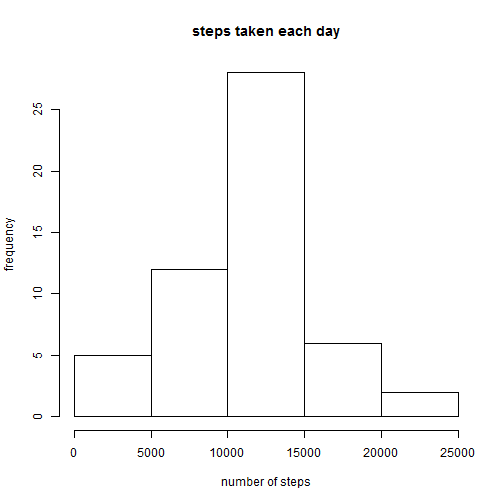
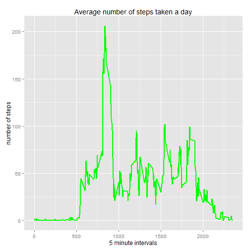
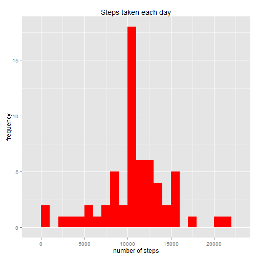
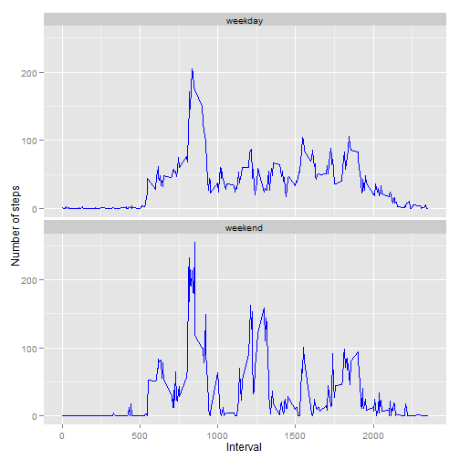

## Loading and preprocessing the data
Load the data (i.e. read.csv())


```r
activity <- read.csv("activity.csv")
```

Process/transform the data into a format suitable for analysis.

Remove NAs.

```r
activity.na <- activity[complete.cases(activity),]
```

## What is mean total number of steps taken per day?


```r
stepsperday <- aggregate(steps ~ date, data=activity.na,sum)
```

Make a histogram of the total number of steps taken per day.


```r
hist(stepsperday$steps, main="steps taken each day",xlab="number of steps", ylab = "frequency")
```

 

Calculate and report the mean of the total number of steps taken per day.


```r
stepsperdaymean <- mean(stepsperday$steps, na.rm=TRUE)
stepsperdaymean
```

```
## [1] 10766.19
```

Calculate and report the median of the total number of steps taken per day.


```r
stepsperdaymedian <- median(stepsperday$steps, na.rm=TRUE)
stepsperdaymedian
```

```
## [1] 10765
```

## What is the average daily activity pattern?
Make a time series plot of the 5 minute interval and the avg number of steps taken for all days.


```r
stepsinterval <- aggregate(steps ~ interval, data=activity.na, mean)
names(stepsinterval)[2] <- "mean_steps"
head(stepsinterval)
```

```
##   interval mean_steps
## 1        0  1.7169811
## 2        5  0.3396226
## 3       10  0.1320755
## 4       15  0.1509434
## 5       20  0.0754717
## 6       25  2.0943396
```

```r
library(ggplot2)
ggplot(stepsinterval, aes(x=interval, y=mean_steps)) +   
  geom_line(color="green", size=1) +  
  labs(title="Average number of steps taken a day", x="5 minute intervals", y="number of steps")
```

 

Which 5 minute interval has in the dataset contains the maximum number of steps?


```r
maxinterval <- stepsinterval[which.max(stepsinterval$mean_steps),1]  
maxinterval
```

```
## [1] 835
```

## Imputing missing values
Calculate and report the total number of missing values.


```r
missing <- sum(!complete.cases(activity))
missing
```

```
## [1] 2304
```

Replace missing values with the mean for the 5 minute interval


```r
activity2 <- merge(activity, stepsinterval, by = 'interval', all.y = F)
activity2$steps[is.na(activity2$steps)] <- as.integer(round(activity2$mean_steps[is.na(activity2$steps)]))
keeps <- names(activity)
activity2 <- activity2[keeps]
stepsperday2 <- aggregate(steps ~ date, data=activity2, sum)
```

Make a histogram of the total steps taken each day


```r
stepsperday2 <- aggregate(steps ~ date, data=activity2, sum)
names(stepsperday2)[2] <- "sum_steps"
ggplot(stepsperday2, aes(x=sum_steps)) +   
  geom_histogram(fill = "red", binwidth = 1000) + 
  labs(title="Steps taken each day", 
       x = "number of steps", y = "frequency") 
```

 

Calculate and report the mean total number of steps taken per day


```r
stepsperdaymean2 <- mean(stepsperday2$sum_steps)
stepsperdaymean2
```

```
## [1] 10765.64
```

Calculate and report the median number of steps taken per day


```r
stepsperdaymedian2 <- median(stepsperday2$sum_steps)
stepsperdaymedian2
```

```
## [1] 10762
```
Do these values differ from the first set?
Yes, the values are slightly lower.

## Are there differences in activity patterns between weekdays and weekends?

Create a new factor variable with two levels - weekdays and weekend.


```r
activity3 <- activity2
weekend <- weekdays(as.Date(activity3$date)) %in% c("Saturday", "Sunday")
activity3$daytype <- "weekday"
activity3$daytype[weekend == TRUE] <- "weekend"
activity3$daytype <- as.factor(activity3$daytype)
newinterval <- aggregate(steps ~ interval + daytype, data=activity3, mean)
names(newinterval)[3] <- "mean_steps"
```

Make a panel plot of the 5 minute interval and the average number of steps taken.

```r
ggplot(newinterval, aes(x=interval, y=mean_steps)) + 
  geom_line(color="blue") + 
  facet_wrap(~ daytype, nrow=2, ncol=1) +
  labs(x="Interval", y="Number of steps") 
```

 


